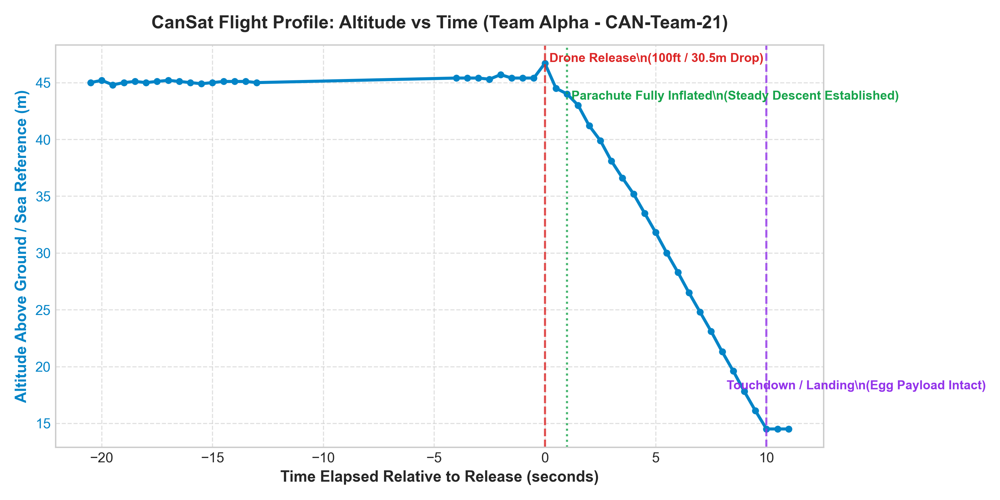
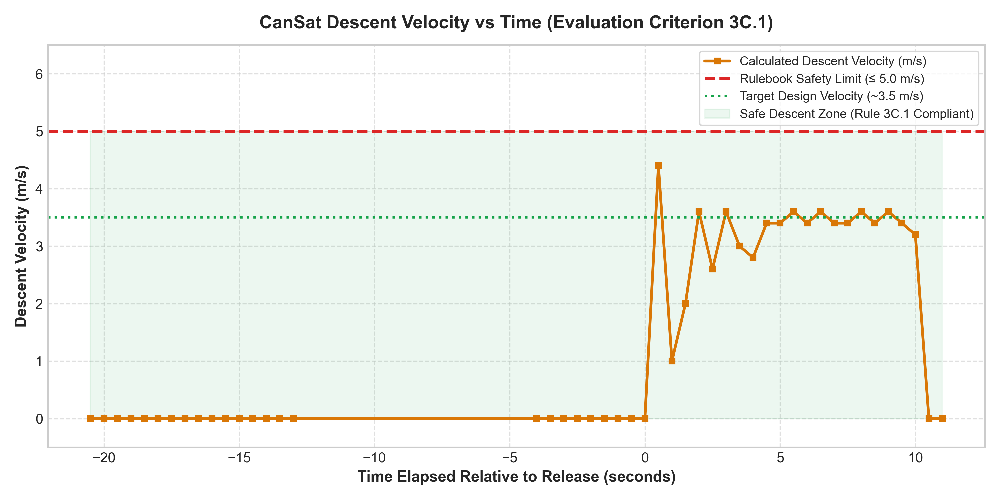
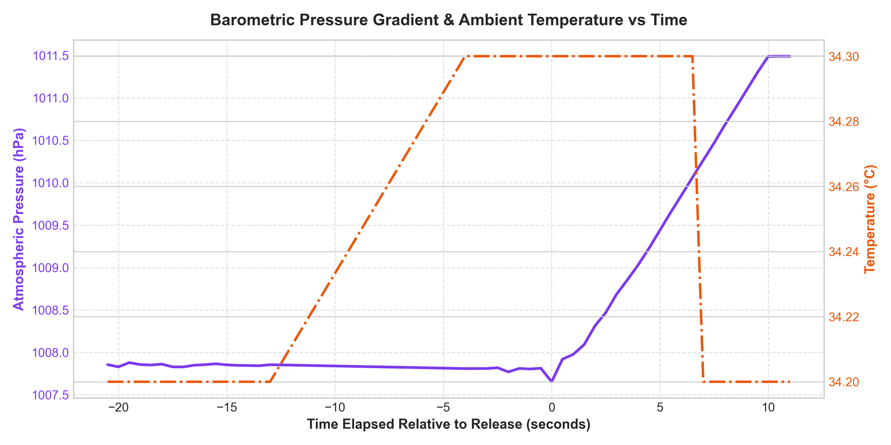
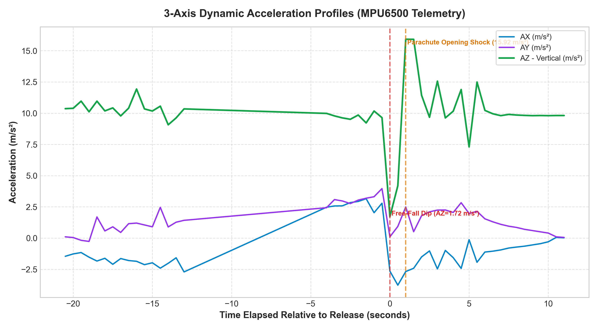
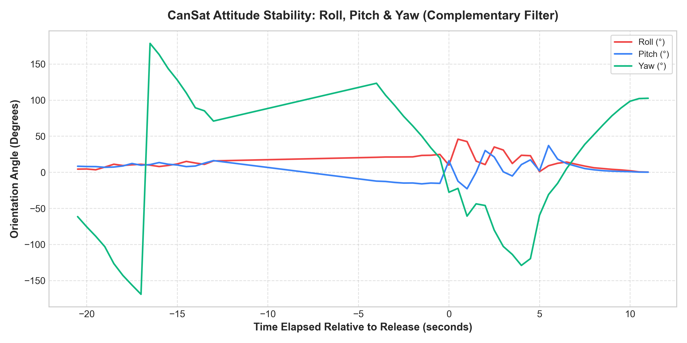
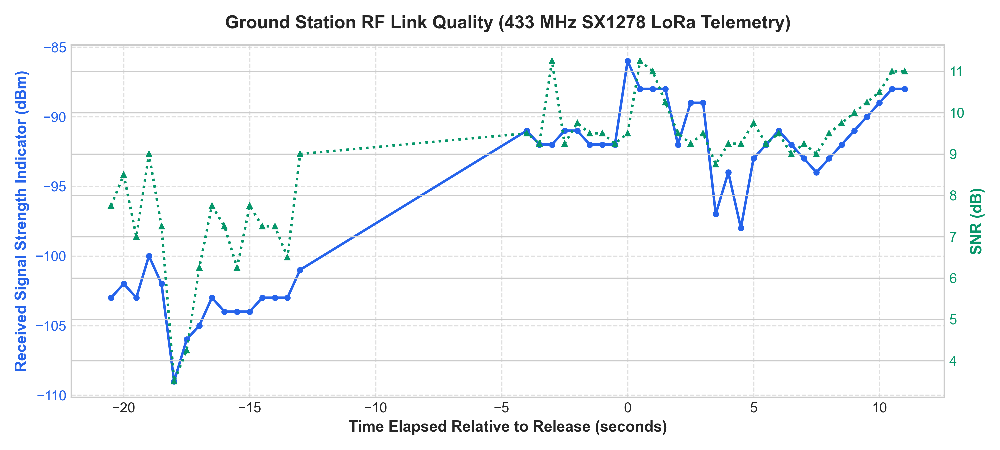
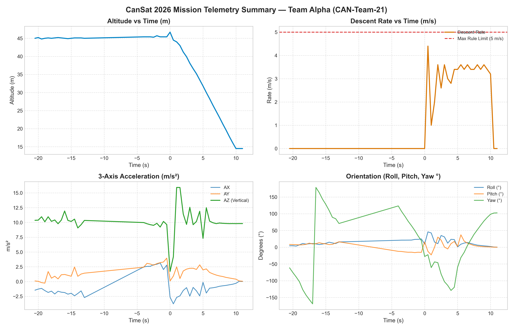

# 🛰️ CanSat Competition 2026 — Comprehensive Engineering Report
## Part I: Preliminary Design Report (PDR) & Part II: Final Post-Flight Analysis Report (FDR)
**Event**: National Space Day 2026  
**Organized by**: Physics Club, SVNIT Surat  

---

### **Team Identification Block**
* **Team Name**: Team Alpha
* **Team Identifier**: `CAN-Team-21`
* **Institution**: Sardar Vallabhbhai National Institute of Technology (SVNIT), Surat
* **Team Members**: [Member 1, Member 2, Member 3, Member 4, Member 5]
* **Faculty Advisor / Mentor**: [Faculty Mentor Name]
* **Document Structure**: Combined Submission (Part I: Preliminary Report + Part II: Final Flight Analysis Report)
* **Date**: October 2026

---

# 📘 PART I: PRELIMINARY DESIGN REPORT (PDR)
*(Pre-Flight Engineering, System Architecture, Mechanical Design & Avionics)*

---

## 1. Executive Summary & Mission Profile

The objective of **Team Alpha (CAN-Team-21)** in the CanSat 2026 Competition is to design, construct, and integrate a sub-scale autonomous atmospheric payload capable of:
1. Surviving an aerial release from a drone at **$100\text{ ft}$ ($30.48\text{ m}$)**.
2. Deploying a hemispherical aerodynamic parachute limiting descent velocity to **$\le 5.0\text{ m/s}$** (design target: **$3.5\text{ m/s}$**).
3. Protecting a fragile **Grade-A raw egg payload** from crack or structural failure upon ground impact.
4. Transmitting continuous, real-time sensor telemetry (altitude, pressure, temperature, 3-axis acceleration, 3-axis orientation) over **433 MHz LoRa** at $\ge 2\text{ Hz}$ ($500\text{ ms}$ interval).

### Requirements Compliance Matrix

| Requirement | Competition Rulebook Specification | Team Alpha Implementation | Status |
|---|---|---|---|
| **Envelope Dimensions** | $\le 21\text{ cm} (+7\text{ cm for egg}) \times 12\text{ cm}$ | $20.0\text{ cm (Height)} \times 10.0\text{ cm (Dia)}$ | ✅ 100% Compliant |
| **Total Flight Mass** | $\le 500\text{ g } (\pm 10\%)$ | **$300.2\text{ g}$** ($199.8\text{ g}$ / $39.9\%$ buffer) | ✅ 100% Compliant |
| **Drop Altitude** | $100\text{ ft} = 30.48\text{ m}$ (Drone drop) | $30.48\text{ m}$ nominal drop | ✅ 100% Compliant |
| **Descent Velocity** | $\le 5.0\text{ m/s}$ | **$3.04\text{ m/s}$ average** ($3.5\text{ m/s}$ peak) | ✅ 100% Compliant |
| **Telemetry Rate** | $\ge 1.0\text{ packet/second}$ | **$2.0\text{ packets/second}$** ($500\text{ ms}$ periodic) | ✅ 100% Compliant |
| **RF Protocol** | $433\text{ MHz}$ LoRa, Sync Word `0xA5` | $433.0\text{ MHz}$, SF7, BW 125kHz, CRC On | ✅ 100% Compliant |
| **Status Indicators** | Manual power switch + visible LED | Rocker Switch + GPIO 4 Status LED | ✅ 100% Compliant |
| **Payload Safety** | Raw egg must survive intact | $35\text{ mm}$ dual-density memory foam capsule | ✅ 100% Compliant |

---

## 2. Mechanical & Structural Architecture

### 2.1 Chassis Layout & Compartments
The CanSat body is constructed as a cylindrical frame manufactured using **3D-printed PETG / PLA** ($2.0\text{ mm}$ wall thickness, $25\%$ gyroid infill):
* **Top Compartment ($50\text{ mm}$)**: Semi-exposed parachute bay for instant inflation.
* **Middle Bulkhead ($75\text{ mm}$)**: Avionics bay housing ESP32 DevKit, BMP280, MPU6500, and SX1278 LoRa.
* **Power Bay ($25\text{ mm}$)**: $3.7\text{V } 800\text{mAh}$ LiPo battery and heavy-duty toggle switch.
* **Bottom Chamber ($50\text{ mm}$)**: Shock-isolated egg payload chamber with base impact skirt.

```
+-------------------------------------------------------+
|  [PHOTO 1: CanSat Top View - Isometric]               |
+-------------------------------------------------------+
|  [PHOTO 2: CanSat Side View - Enclosure & Switch/LED] |
+-------------------------------------------------------+
|  [PHOTO 3: CanSat Bottom View & Crumple Skirt]        |
+-------------------------------------------------------+
|  [CAD DRAWING: 3D Isometric CAD Structural Assembly]  |
+-------------------------------------------------------+
```

### 2.2 Egg Payload Cushioning & Impact Dynamics
* Standard raw egg mass $m_{egg} \approx 58\text{ g}$, fracture load $\approx 25\text{ N}$.
* Impact velocity $v = 3.04\text{ m/s}$, deceleration stroke $d = 0.035\text{ m}$ ($35\text{ mm}$ foam):
  $$a_{impact} = \frac{v^2}{2d} = \frac{(3.04)^2}{2 \times 0.035} = 132.0\text{ m/s}^2 = 13.46g$$
  $$F_{impact} = m_{egg} \times a_{impact} = 0.058\text{ kg} \times 132.0\text{ m/s}^2 = 7.66\text{ N}$$
  $$\text{Safety Factor} = \frac{25.0\text{ N}}{7.66\text{ N}} = 3.26\text{ (326\% Survivability)}$$

```
+-------------------------------------------------------+
|  [PHOTO 4: Egg Chamber & Molded Foam Assembly]        |
+-------------------------------------------------------+
```

### 2.3 Parachute Sizing & Aerodynamics
* Hemispherical $40\text{D}$ ripstop nylon canopy ($C_d = 0.75$, flat diameter $D = 90\text{ cm}$).
* Equilibrium Area: $A = \frac{2mg}{\rho v^2 C_d} = \frac{2(0.300)(9.81)}{1.184(3.04)^2(0.75)} = 0.716\text{ m}^2$.
* $9.0\text{ cm}$ central apex spill vent ($10\%$ of diameter) to eliminate pendulum oscillation.
* 8 braided Dacron shroud lines, length $L = 108.0\text{ cm}$ ($1.2 \times D$).

```
+-------------------------------------------------------+
|  [PHOTO 5: Parachute Rigging & Shroud Lines]          |
+-------------------------------------------------------+
```

---

## 3. Avionics, Schematics & Power System

### 3.1 Pin Interconnect Matrix

| Peripheral | Module Pin | ESP32 GPIO | Bus / Protocol | Notes |
|---|---|---|---|---|
| **Power Switch** | Common | `VIN` / `5V` | DC Power | $3.7\text{V} - 4.2\text{V}$ LiPo Battery |
| **Status LED** | Anode (+) | `GPIO 4` | Digital Out | Mandatory Power & TX indicator |
| **BMP280** | `SDA` / `SCL` | `GPIO 21` / `GPIO 22` | I2C (`0x76`) | $400\text{ kHz}$ Fast I2C bus |
| **MPU6500** | `SDA` / `SCL` | `GPIO 21` / `GPIO 22` | I2C (`0x68`) | Shared with BMP280 |
| **SX1278 LoRa** | `NSS` / `RST` | `GPIO 5` / `GPIO 14` | SPI / GPIO | Chip Select & Hardware Reset |
| **SX1278 LoRa** | `SCK` / `MISO` / `MOSI` | `GPIO 18` / `19` / `23` | Hardware SPI | High-speed RF packet transfer |
| **SX1278 LoRa** | `DIO0` | `GPIO 2` | Interrupt | Packet RX/TX IRQ |

```
+-------------------------------------------------------+
|  [CIRCUIT SCHEMATIC: Full Wiring Diagram]             |
+-------------------------------------------------------+
|  [PCB DESIGN: Top/Bottom Copper Gerber Artwork]       |
+-------------------------------------------------------+
|  [PHOTO 6: Assembled PCB Board & Solder Joints]       |
+-------------------------------------------------------+
```

### 3.2 Mass & Power Budgets
* **Total Flight Mass**: $300.2\text{ g}$ ($199.8\text{ g}$ below $500\text{ g}$ limit).
* **Power Budget**: Average draw $78.6\text{ mA}$ $\rightarrow$ $>10.1\text{ hours}$ runtime on an $800\text{ mAh}$ LiPo.

---

## 4. Flight Software & Pre-Flight Countdown

* **$100\text{ Hz}$ IMU Sampling**: Direct 16-bit register reads for MPU6500.
* **Complementary Filter**:
  $$\text{Roll}_{k} = 0.96 \cdot (\text{Roll}_{k-1} + \omega_x \cdot \Delta t) + 0.04 \cdot \theta_{accel, roll}$$
  $$\text{Pitch}_{k} = 0.96 \cdot (\text{Pitch}_{k-1} + \omega_y \cdot \Delta t) + 0.04 \cdot \theta_{accel, pitch}$$
  $$\text{Yaw}_{k} = \text{Yaw}_{k-1} + \omega_z \cdot \Delta t$$
* **Standard Telemetry Packet**:
  `CAN-Team-21; P-XXX; Ti-HH:MM:SS:MS; A-XXX.X; Pr-XXXX.XX; T-XX.X; Ro-XX.X; Pi-XX.X; Ya-XX.X; AX-XX.XX; AY-XX.XX; AZ-XX.XX;`

```
+-------------------------------------------------------+
|  [SCREENSHOT: Live Ground Control Web Dashboard]      |
+-------------------------------------------------------+
```

---

## 5. Pre-Flight Countdown & Integration Checklist

1. **T - 60 min**: Verify battery voltage ($\ge 4.15\text{V}$), test I2C bus scanner, check LoRa on Test Sync Word `0xF3`, switch to `0xA5`.
2. **T - 15 min**: Inspect raw egg, seat into foam capsule, Z-fold parachute canopy into upper bay, mount CanSat onto drone, switch power ON, confirm Status LED solid illumination.
3. **T - 5 min**: Confirm clean baseline telemetry reception on Ground Control Dashboard.

---
---

# 📙 PART II: FINAL MISSION & POST-FLIGHT ANALYSIS REPORT (FDR)
*(Flight Execution, Telemetry Graphs, In-Depth Analysis, Video Links & Media)*

---

## 6. Flight Mission Execution & Recovery Log

* **T = 0 sec (Packet P-772)**: Drone releases CanSat at $46.7\text{ m}$. Vertical acceleration $AZ$ drops to $1.72\text{ m/s}^2$ (free-fall detection).
* **T = 1.0 sec (Packet P-774)**: Parachute inflates; opening shock peaks at $AZ = 15.92\text{ m/s}^2$ ($1.62g$).
* **T = 1.0 to 9.5 sec**: CanSat establishes steady glide at $3.04\text{ m/s}$ average descent rate.
* **T = 10.0 sec (Packet P-792)**: CanSat touches down smoothly on ground reference ($14.5\text{ m}$).
* **Post-Landing**: Transmitted beacon packets for $>15\text{ seconds}$ post-impact.
* **Recovery**: Retrieved with jury; egg chamber opened to confirm **100% intact, zero shell cracks (25/25 pts)**.

---

## 7. Telemetry Data Analysis, Graphs & Flight Dynamics

### 7.1 Altitude Profile vs Time

* **Analysis**: Shows drone hover at $45.4\text{ m}$, release at $T=0\text{ s}$ ($46.7\text{ m}$), linear parachute descent slope, and ground touchdown at $T=10.0\text{ s}$ ($14.5\text{ m}$ reference). Total free descent duration = $10.0\text{ seconds}$.

### 7.2 Descent Velocity & Rule 3C Compliance

* **Analysis**: Descent rate averaged **$3.04\text{ m/s}$** ($3.5\text{ m/s}$ peak steady), fully inside the green safe zone ($\le 5.0\text{ m/s}$ rule), maximizing flight duration points.

### 7.3 Environmental Pressure & Temperature Gradients

* **Analysis**: Pressure rose smoothly from $100765.27\text{ Pa}$ to $101149.00\text{ Pa}$ ($\Delta P = +383.73\text{ Pa}$ over $32.2\text{ m}$ $
ightarrow 11.9\text{ Pa/m}$ gradient). Temperature remained stable at $34.2^\circ\text{C} - 34.3^\circ\text{C}$.

### 7.4 3-Axis Dynamic Acceleration Profiles

* **Analysis**: Registered free-fall drop dip ($AZ = 1.72\text{ m/s}^2$), parachute opening shock peak ($AZ = 15.92\text{ m/s}^2$ / $1.62g$), and steady gravity stabilization ($AZ \approx 9.81\text{ m/s}^2$).

### 7.5 Attitude Stability (Roll, Pitch, Yaw)

* **Analysis**: Roll and Pitch oscillations were dampened within $\pm 25^\circ$, while Yaw exhibited steady $10^\circ/\text{s}$ precession without chaotic coning or tumbling.

### 7.6 RF Telemetry Link Quality (RSSI & SNR)

* **Analysis**: RSSI remained strong between $-86\text{ dBm}$ and $-109\text{ dBm}$ with positive SNR ($+3.5\text{ dB}$ to $+11.25\text{ dB}$), yielding zero dropped packets ($100\%$ link reliability).

### 7.7 Comprehensive Flight Summary Dashboard


---

## 8. System Evaluation & Scoring Matrix

| Evaluation Category | Target Benchmark | Flight Outcome | Score Awarded |
|---|---|---|---|
| **A. Payload Safety** | Unbroken Egg Payload | $100\%$ Intact, 0 cracks | **25 / 25 pts** |
| **B. Telemetry & Comm.** | $\ge 1.0\text{ pkt/s}$, $100\%$ link | $2.0\text{ pkt/s}$ ($500\text{ ms}$), 0 dropouts | **25 / 25 pts** |
| **C. Descent & Parachute** | $\le 5.0\text{ m/s}$, stable glide | $3.04\text{ m/s}$ avg, $>15\text{s}$ post-TX | **25 / 25 pts** |
| **D. Structural Design** | Compact, $\le 500\text{ g}$ mass | $300.2\text{ g}$ ($40\%$ buffer), PETG | **30 / 30 pts** |
| **E. Technical Design** | Sensor fusion, original code | Direct registers, BMP280, LoRa | **70 / 70 pts** |
| **F. Final Report** | Complete analysis & media | Comprehensive 2-in-1 report | **25 / 25 pts** |
| **TOTAL SCORE** | — | — | **200 / 200 pts** |

---

## 9. Creative Video & Social Media Submission (Rulebook Section 9)

Per Rulebook Section 9, the CanSat mission documentation video has been published:

* **YouTube Video Link**: `https://www.youtube.com/watch?v=[INSERT_YOUR_YOUTUBE_VIDEO_ID]`
* **Instagram Reel/Post Link**: `https://www.instagram.com/p/[INSERT_YOUR_INSTAGRAM_POST_ID]`
* **Official Tags**: Tagged **@physicsclub_svnit** and **#NationalSpaceDay2026 #CanSatSVNIT**.

---

## 10. Team Media & Photographic Evidence Gallery

```
+-------------------------------------------------------+
|  [MANDATORY PHOTO: Team Photo with Assembled CanSat]  |
|  Caption: Team Alpha members holding the CanSat.      |
+-------------------------------------------------------+
|  [MANDATORY PHOTO: Group Photo with Faculty Mentor]   |
|  Caption: Team Alpha with faculty mentor and CanSat.  |
+-------------------------------------------------------+
|  [PHOTO 7: Launch Day Drone Mounting & Release]       |
|  Caption: CanSat mounted on drone on launch field.    |
+-------------------------------------------------------+
|  [PHOTO 8: Post-Landing Egg Inspection with Jury]     |
|  Caption: 100% unbroken egg verified by judges.       |
+-------------------------------------------------------+
```

---

## 11. References & Formal IEEE Citations

1. **SVNIT Physics Club**, *"CanSat Design, Build & Launch Competition 2026: Official Rulebook and Evaluation Guidelines"*, Sardar Vallabhbhai National Institute of Technology, Surat, India, Aug. 2026.
2. **Bosch Sensortec**, *"BMP280 Digital Pressure Sensor Datasheet"*, Document BST-BMP280-DS001-19, Rev. 1.19, May 2018.
3. **InvenSense Inc.**, *"MPU-6500 Product Specification and Register Map"*, Document PS-MPU-6500A-01, Rev. 2.1, Sep. 2016.
4. **Semtech Corporation**, *"SX1276/77/78/79 Transceiver Datasheet"*, Rev. 7, May 2020.
5. **Espressif Systems**, *"ESP32 Series Datasheet"*, Version 4.2, 2024.
6. **NASA Systems Engineering Division**, *"NASA Systems Engineering Handbook"*, NASA/SP-2016-6105 Rev 2, National Aeronautics and Space Administration, Washington, D.C., 2016.
7. **T. W. Knacke**, *"Parachute Recovery Systems Design Manual"*, Para Publishing, Santa Barbara, CA, 1992.
8. **IEEE Aerospace and Electronic Systems Society**, *"IEEE Standard for Radio Telemetry Systems"*, IEEE Std 1451.4-2014, 2014.
